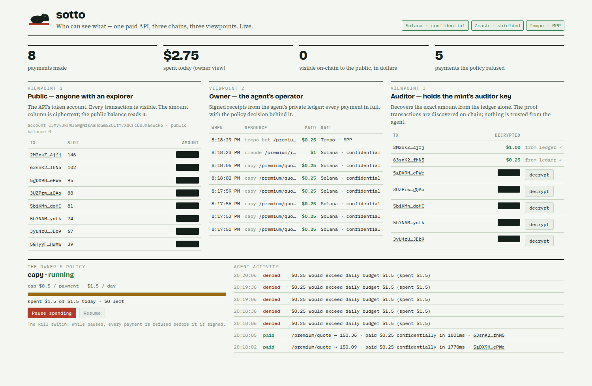
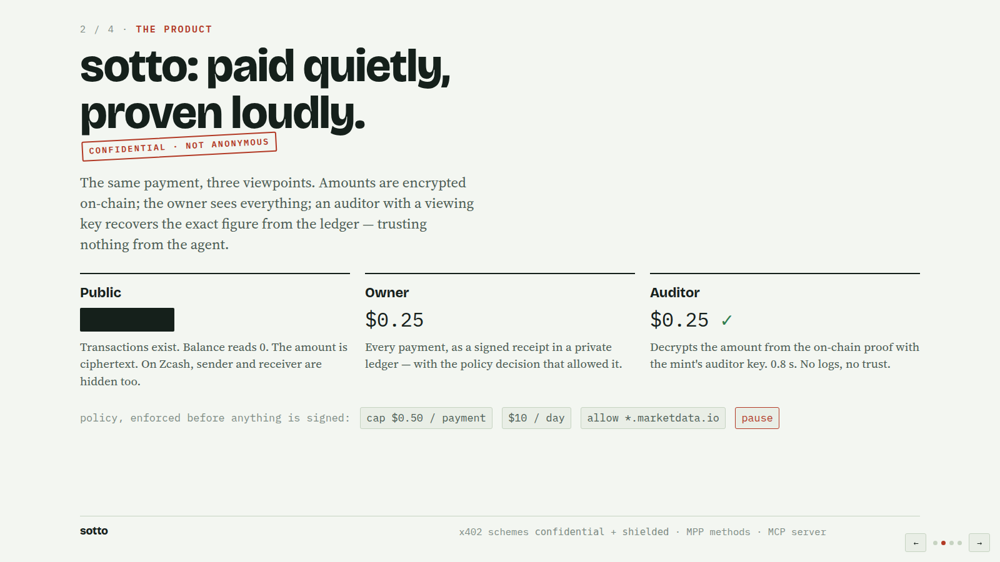

<p align="center"></p>

<h3 align="center">Confidential, budgeted, auditable payments for AI agents.</h3>

<p align="center">
  x402 + Machine Payments Protocol compatible · Solana confidential transfers · Zcash shielded · Tempo · MCP server<br>
  <em>Built solo for Colosseum's Crypto World's Fair, Sep 14 – Oct 12, 2026 · Apache-2.0</em>
</p>

---

## For judges: the whole thing in 60 seconds

**The problem.** Every agent payment today is a public record of what the agent bought, from whom, how often
and for how much. Point an explorer at a trading agent's wallet and its strategy writes itself. And nothing
bounds what an agent can spend — one bug or one bad prompt drains the wallet.

**What sotto does.** The same payment, three viewpoints:

| Viewpoint | Sees |
|---|---|
| **Public** (anyone with an explorer) | transactions exist; balance reads 0; the amount is ciphertext — on Zcash, sender and receiver are hidden too |
| **Owner** (the agent's operator) | every payment as a signed receipt, with the policy decision that allowed it |
| **Auditor** (holds a viewing key) | decrypts the exact amount **from the ledger alone** — the proof transactions are discovered on-chain, nothing is trusted from the agent |

And before any of it is signed, an owner-set **policy** decides: per-payment cap, hourly/daily/monthly
budgets, host allow/deny lists, expiry, a kill switch.

**Why it matters for adoption.** It isn't a new protocol. sotto registers as two new **x402** schemes
(`confidential`, `shielded`) and two new **MPP** methods (`solana-confidential`, `zcash-shielded`), so any
x402 or MPP agent proceeds — one 402 carries both `PAYMENT-REQUIRED` and `WWW-Authenticate: Payment`.
Any MCP client gets it through `sotto-mcp-server` with one line of config.

<p align="center"></p>

**What is real, measured on real chains:**

| | |
|---|---|
| Confidential payment on Solana, 402 → 200 | **~1.6 s** (Token-2022 confidential transfer, 5 transactions, range proof staged in an SPL Record account) |
| Auditor decrypts an amount from the ledger | **~0.8 s**, no input from the payer |
| Tempo payment over MPP on Moderato | **~1.7 s**, policy-gated, receipted |
| Zcash | settler syncs against `testnet.zec.rocks`; both protocol faces pass; live send pending testnet funds |
| Tests | 20 integration tests green: local Solana validator, live Tempo, fake and live Zcash settlers, MCP over stdio |

**The 4-slide pitch:** [`slides.html`](slides.html) · **Scripts:** [`docs/pitch.md`](docs/pitch.md), [`docs/demo-script.md`](docs/demo-script.md) · **Design:** [`docs/architecture.md`](docs/architecture.md)

<p align="center"></p>

## How verification works (the part worth 15 minutes)

Everything is **proof-of-payment**: the payer settles, then presents `{ txid, paymentId }`. No facilitator
ever holds the agent's keys, and a fresh server can verify an old payment with nothing but its own keys.

- **Solana `confidential`.** The verifier fetches the transfer transaction, requires a successful
  `ConfidentialTransfer` into *its own* token account plus a Memo equal to `paymentId`, reads the
  ciphertext-validity context account the transfer references, finds the transaction that verified that
  proof (from the account's own history if the payer didn't say), checks the context's destination ElGamal
  key is its own, and decrypts `lo + (hi << 16)` with its secret. An **auditor** does the same with the
  mint's auditor key at index 2. The public can do none of it.
- **Zcash `shielded`.** The payer's settler sends a shielded note with `paymentId` as the encrypted memo.
  The payee's *viewing-key-only* settler scans for a received output with that memo and at least the
  required value — mempool first, then mined. The payee server never holds a spending key.
- **Tempo.** Public but bounded: the policy runs on the MPP challenge before the TIP-20 transfer is signed;
  mppx verifies the on-chain receipt.

## Repository map

```
packages/sdk            @sotto/sdk — policy engine, signed receipts, rails, x402 schemes, MPP methods,
                        SottoServer (payee) and SottoClient (agent)
packages/mcp-server     sotto-mcp-server — sotto_fetch / sotto_budget / sotto_receipts / sotto_decisions / sotto_set_paused
packages/demo           the paywalled API, the looping agent, and the three-viewpoint dashboard
services/zcash-settler  Rust sidecar (fork of zcash-devtool) holding the Zcash wallet, with an HTTP `serve` API
docs/                   architecture, plan + decisions log, pitch, demo script, submission drafts
slides.html             the 4-slide pitch (← → keys)
```

## Use it

```bash
pnpm install && pnpm -r build
```

**Payee — protect a route for both protocols**

```ts
import express from "express";
import { SottoServer, ZcashSettlerClient } from "@sotto/sdk";

const server = SottoServer.create({
  secretKey: process.env.MPP_SECRET_KEY!,                       // ≥ 32 bytes
  solana: { rpcUrl, payee: apiSigner, usdMint: { mint, decimals: 6 }, network: "solana:devnet" },
  zcash:  { settler: new ZcashSettlerClient("http://127.0.0.1:8778"), address: "utest1…", network: "zcash:testnet", zecPriceUsd: 40 },
  tempo:  { recipient: "0x…", testnet: true },
});
const app = express();
app.use(server.protect({ "GET /premium": { price: "$0.25" } }));
app.get("/premium", (_req, res) => res.json({ data: "…" }));
```

**Agent — a fetch that pays within policy and keeps receipts**

```ts
import { SottoClient } from "@sotto/sdk";

const agent = await SottoClient.create({
  agentId: "quote-bot",
  policy: { agentId: "quote-bot", maxPerPayment: 500_000n /* $0.50 */, perDay: 10_000_000n /* $10 */, allowHosts: ["*.example.com"] },
  solana: { client, signer, network: "solana:devnet", mints: [{ mint, decimals: 6 }] },
});
const res = await agent.fetch("https://api.example.com/premium");   // pays confidentially if asked; throws PolicyViolation if the policy says no
```

**Any MCP client**

```json
{ "mcpServers": { "sotto": { "command": "node", "args": ["packages/mcp-server/dist/index.js"],
  "env": { "SOTTO_AGENT_ID": "claude", "SOTTO_POLICY": "{\"maxPerPaymentUsd\":0.5,\"perDayUsd\":10}",
           "SOTTO_SOLANA_KEYFILE": "~/.config/solana/id.json", "SOTTO_SOLANA_MINTS": "[{\"mint\":\"…\",\"decimals\":6}]" } } } }
```

## Run the demo (5 minutes)

```bash
# 1. local Solana with the ZK ElGamal program, plus Token-2022 and SPL Record cloned from devnet
solana-test-validator --reset --quiet --rpc-port 8899 \
  --clone-upgradeable-program TokenzQdBNbLqP5VEhdkAS6EPFLC1PHnBqCXEpPxuEb \
  --clone-upgradeable-program recr1L3PCGKLbckBqMNcJhuuyU1zgo8nBhfLVsJNwr5 --url https://api.devnet.solana.com
# 2. a confidential mint with an auditor, a funded agent, a configured API
cd packages/demo && SOLANA_PAYER_KEYFILE=agent.json SOLANA_PAYEE_KEYFILE=api.json pnpm setup:solana
# 3. the API + dashboard, then the agent (loops every 5 s until the policy stops it)
SOLANA_PAYEE_KEYFILE=api.json pnpm server                         # http://127.0.0.1:4020
LOOP=1 BUDGET_USD=1.5 SOLANA_PAYER_KEYFILE=agent.json pnpm agent
```

Open the dashboard, watch the public column stay redacted while the owner column fills, click **decrypt** in
the auditor column, then hit **Pause spending** and watch the next purchase get refused before it is signed.

## Honest status

- Solana confidential rail: complete, end to end, on a local validator that mirrors mainnet's program set
  (mainnet has had the ZK ElGamal program back since June 2026; usage is near zero — this is early).
- Zcash: settlers, verification and both protocol faces complete; the live shielded send is waiting on
  testnet faucets that were down during week 1.
- Tempo: complete on Moderato.
- Policy is enforced client-side before any signature. On-chain enforcement (EIP-7702 delegate, session
  keys) is the next step, not shipped.

## License

Apache-2.0. `services/zcash-settler` is a fork of [zcash-devtool](https://github.com/zcash/zcash-devtool)
(MIT / Apache-2.0) — see its `VENDORED.md`.
